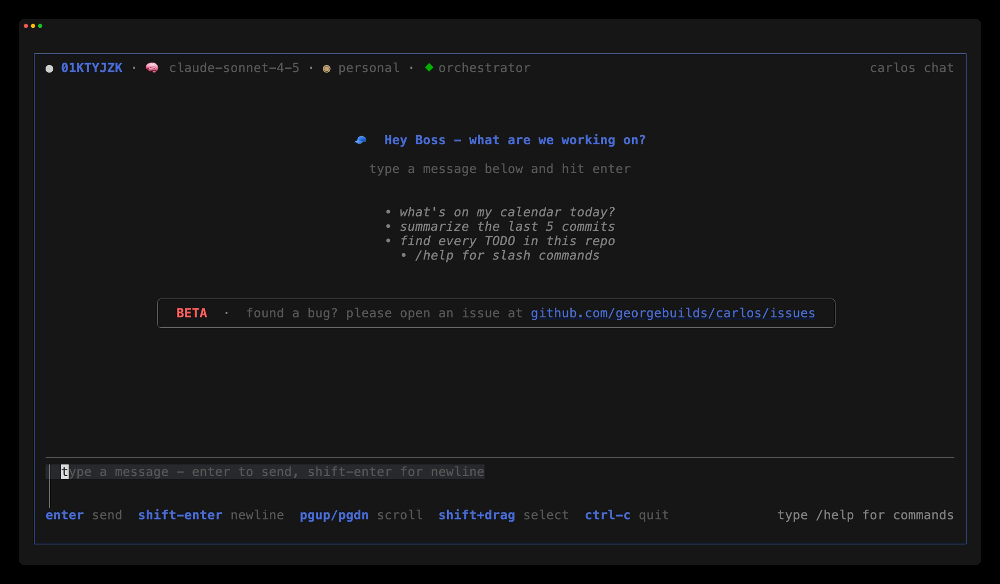
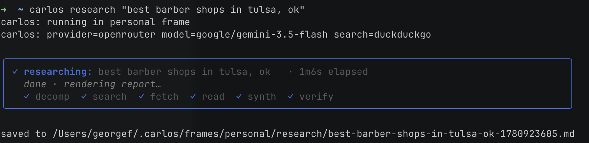

<p align="center">
  
</p>

# carlos

<p align="center">
  <a href="https://github.com/georgebuilds/carlos/releases"></a>
  <a href="https://codecov.io/gh/georgebuilds/carlos"></a>
  <a href="https://goreportcard.com/report/github.com/georgebuilds/carlos"></a>
  <a href="./LICENSE"></a>
</p>

A pure-Go TUI agent. Single binary around 30 MB. No CGO. Cross-compiled for darwin + linux × amd64 + arm64.

Marketing copy and feature tour live at [georgebuilds.github.io/carlos](https://georgebuilds.github.io/carlos/). This README is for getting carlos running and for Go developers who want to contribute.

---

## Quick start

### Install

```
brew install georgebuilds/tap/carlos
carlos
```

Or grab a tarball from [Releases](https://github.com/georgebuilds/carlos/releases) and drop `carlos` into your `$PATH`.

### First run

Onboarding takes ~30 seconds:

1. Your name
2. A provider (Anthropic, OpenAI, OpenRouter, Ollama, or Gemini) and an API key
3. A model from a curated dropdown (OpenRouter shows live pricing)
4. Skills convention
5. Optional Obsidian vault path
6. Whether to enable the background daemon (scheduled runs, gateway delivery)
7. A messaging gateway (ntfy / Telegram), if the daemon is on
8. Import any MCP servers already configured in Claude Code

<p align="center">
  
</p>

Everything lands in `~/.carlos/config.yaml` (mode 0600). Re-enter any single screen later with `carlos onboard --only providers` (or `models`, `skills`, `vault`, `daemon`, `gateway`, `mcp`).

After onboarding you're in the chat TUI. Type a question. carlos answers, calls tools when needed (prompting for the risky ones), and keeps the transcript in a SQLite event log at `~/.carlos/state.db`.

<p align="center">
  
</p>

### Keys worth knowing

| Key | What |
|---|---|
| `Ctrl+F` | open the frame switcher |
| `/help` | full slash-command list |
| `!<cmd>` | run a shell command in your context |
| `/agents` | open the sub-agent manage view |
| `/whoami` | current frame, mode, provider, model |
| `/permissions` | layered approval state + audit log |
| `/mcp` | MCP server panel: status + tool counts (manage servers with `carlos mcp`) |

#### Demo: the user-shell

A `!`-prefixed line runs in your context without leaving the chat. Enter runs it in the foreground; `Ctrl+Z` pushes a running job to the background; `Ctrl+J` opens the jobs overlay (`j`/`k` to navigate, `d` to cancel, `Esc` to close). The slash variants are `/shell <cmd>`, `/bg`, and `/jobs`. A background job can also outlive the session entirely: `carlos run "<cmd>"` hands it to the daemon, and `carlos jobs` / `carlos attach <id>` / `carlos logs <id>` / `carlos stop <id>` drive it from anywhere.

<!-- Demo GIF: record on a real terminal with `vhs demos/usershell-jobs.tape`
     (it writes docs/branding/screenshots/usershell-jobs.gif), then uncomment:
<p align="center">
  
</p>
-->

The recording is scripted in [`demos/usershell-jobs.tape`](demos/usershell-jobs.tape); regenerate it with `vhs demos/usershell-jobs.tape` (requires [charmbracelet/vhs](https://github.com/charmbracelet/vhs)).

### CLI verbs adjacent to the chat

```
carlos please "<prompt>"         # one-shot, no TUI
carlos research "<question>"     # multi-phase deep research
carlos memory search <query>     # FTS5 over conversation summaries
carlos schedule list|add|rm      # cron + natural language
carlos gateway add               # wizard to configure ntfy / Telegram / Signal
carlos gateway test <channel>    # verify ntfy / Telegram wiring
carlos mcp add|list|get|remove   # manage MCP servers (mirrors `claude mcp`)
carlos daemon enable|disable     # background service
```

All accept `-f <frame>` (or `--frame`) to scope to a specific frame. `carlos please` takes a single positional prompt; multi-word prompts must be quoted (a single hyphenated token like `say-hello` works without quotes).

`carlos please` shows a live 3-row bordered status panel while it runs (current tool, streaming-text preview, tool counter + provider/model); the assistant's final reply prints below the panel on completion.

`carlos research` shows a live phase tracker (decompose, search, fetch, read, synthesize, verify) and writes a cited report under `~/.carlos/frames/<frame>/research/`:

<p align="center">
  
</p>

---

## Contributing

### Prerequisites

- Go toolchain version pinned by `go.mod` (currently `1.26.3`).
- `git` on `$PATH` (the sub-agent sandbox uses `git worktree`).
- No CGO, no system libraries.

### Build and test

```
git clone https://github.com/georgebuilds/carlos
cd carlos
go test ./...
go build ./cmd/carlos
./carlos
```

Cross-compile checks are cheap; run them when touching anything that imports OS-specific paths:

```
GOOS=linux  GOARCH=arm64  go build ./cmd/carlos
GOOS=darwin GOARCH=amd64  go build ./cmd/carlos
```

### Test discipline

- `go test ./...` is the floor. Current count is ~6,300 tests across 47 packages.
- `go vet ./...` must be clean.
- New code aims for 80%+ coverage on touched packages.
- The sub-agent + daemon + event log paths have integration tests; if you touch any of them, run `go test -race ./internal/agent/... ./internal/daemon/...` at least once before pushing.

### Repository layout

```
cmd/carlos/         main TUI binary + daemon entry points
internal/
  agent/            tool-use loop, event log, supervision, layered approval
  config/           ~/.carlos/config.yaml schema + onboarding state
  daemon/           background scheduler (UDS + launchd / systemd)
  farewell/         bordered exit-panel + brew-update probe
  frame/            per-session frames (personal + N user-defined)
  gateway/          chat-surface adapters (ntfy, Telegram, Signal stub)
  mcp/              Model Context Protocol client + tool adapter
  memory/           SQLite FTS5 + summarizer
  miniyaml/         hand-rolled YAML for frontmatter
  notes/            Obsidian vault index + cache (Goldmark + miniyaml)
  projectctx/       per-project context loader (walks AGENTS.md / CLAUDE.md)
  providers/        anthropic, openai, openrouter, ollama, gemini
  research/         decompose → search → fetch → read → synthesize → verify
  sandbox/          local + git-worktree execution
  schedule/         cron + natural-language grammar
  skills/           skill format, loader, inducer, judge, replay-eval
  theme/            light / dark / NO_COLOR / configurable accent
  tools/            every registered tool (notes_*, web_*, code_search, etc.)
  tui/              bubbletea chat / manage / onboarding / slash registry
  usershell/        `!` prefix shell driver, jobs overlay, history
  workspace/        trusted-workspaces store + read-only bash classifier
skills/             bundled starter skills (calendar/, ...)
docs/               GitHub Pages site + llms.txt
```

### Where to look when adding a feature

| You want to | Look here |
|---|---|
| Add a tool | `internal/tools/`, register in `tools.go` |
| Add a slash command | `internal/tui/slash/slash.go` Builtins + handler in `internal/tui/chat/` |
| Wire an MCP server | `carlos mcp add` (or the `mcp:` / `servers:` block in `~/.carlos/config.yaml`); client + adapter live in `internal/mcp/` |
| Add a provider | `internal/providers/<name>/`, satisfy the `Provider` interface |
| Add a frame field | `internal/frame/frame.go`, then sysprompt + render helpers |
| Change permission rules | `internal/agent/policy.go` (`LayeredApprover`) |
| Add an event type | `internal/agent/eventlog_sqlite.go` + state machine |
| Add an onboarding screen | `internal/tui/onboarding/screen_*.go` + flow wiring |

### House conventions

- Single immutable event log is the source of truth. The projection replays from it.
- Atomic writes for any file containing user state: `temp + fsync + rename`. See `internal/config/config.go:Save` for the canonical recipe.
- File modes: `0700` directories, `0600` secret-bearing files (`config.yaml`, `state.db`, `trusted-workspaces.json`, artifact blobs), `0644` elsewhere.
- Prefer editing existing files to creating new ones.
- Default to no comments; add one only when the WHY is non-obvious.

### Release flow

A `v*` tag push fires `.github/workflows/release.yml` which runs goreleaser to build the four-arch tarballs, drafts a GitHub release, and bumps `georgebuilds/homebrew-tap/Formula/carlos.rb`. Publish the draft when ready (`gh release edit v0.X.Y --draft=false`).

---

## License

GPL-3.0-or-later. See [LICENSE](./LICENSE).
